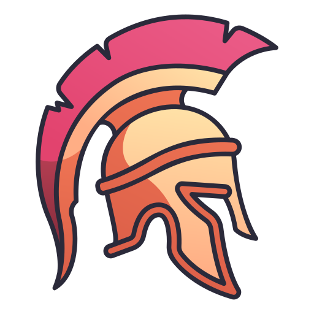

# sparta-war-room 

### This project employs a NodeJS Express server written in TypeScript and utilizes MongoDB for server-side development.  On the client side, JavaScript, HTML, and SCSS are used.  The design draws inspiration from the spirit of Sparta, aiming to function as the official website of the Spartan warriors, contributing a creative and unique aspect to the project.

---

This project utilizes a database to store data and provides access to it through **REST APIs** and **MIGRATIONS**.  The APIs are written in _NodeJS_ and _typescript_, using the _express_ framework with _typescript_.

The project incorporates the following APIs:

| Users data and authentication | Announcements data           | Spartan-tactics data   |
| ----------------------------- | ---------------------------- | ---------------------- |
| + Register                    | + Get all announcements data | + Get all tactics data |
| + Login                       |
| + Logout                      |

---

**Requirements**

- _NodeJS_ version 16.4+
- _MongoDB service_ version 6.0.1+

**Command lines**

- `npm install`   Install all the necessary packages for running and developing the server-side.
- `npm run start`  Build the _TS_ code and execute the compiled _JS_ project.
- `npm run dev-with-migrations`  This command triggers the _migration_ process, initializing the database with essential data to showcase the project's functionality. It subsequently launches _TS_ code using _nodemon_ for a smooth and uninterrupted development experience.
- `npm run dev`  Run _TS_ code with _nodemon_ for seamless development

- `cd-client`  Access the client directory to initiate client-side development.
  - `npm install`   Install all the necessary packages for running and developing the client-side.
  - `npm run sass-compile`  Compile all the _SCSS_ files to _CSS_ files.
  - `npm run sass-watch-folder` Automatically compiles SCSS files into CSS files whenever changes are detected.

---

### **A practical example that exemplifies how the project can be utilized**

https://github.com/Afek-Sakaju/sparta-war-room/assets/100536372/eee36151-148d-4958-8776-18d441721fbd

---

### The technologies used in this project include:

- [x] _**Nodejs**_ : the project is _javascript_ based.
- [x] _**Express**_ : used for the server side routers, middlewares, controllers, and services.
- [x] _**Typescript**_ : the project has been implemented using _typescript_ interfaces.
- [x] _**jwt**_ : implementing authentication using JSON Web Tokens involves securely storing the token for the authenticated user.
- [x] _**MongoDB**_ : utilized with the _**mongoose**_ library for defining schemas and models, which are then utilized in the controllers and services.
- [x] _**mongo-migrate**_ : the **migrations** ensure that the MongoDB handle important database initializations before running, including announcements creation and Spartan-tactics data.
- [x] _**Bcrypt**_ : user passwords are securely encrypted in accordance with best practices to ensure data security.
- [x] **JavaScript** : _javascript_ script files enable interactive behavior in web pages by handling user interactions on elements.
- [x] _**HTML**_ : the project extensively relies on _HTML_ for constructing and defining its web page elements.
- [x] _**SCSS**_ : the project's visual style is elegantly crafted and designed using _scss_.

### Additional technologies used as development tools include:

- [x] _**ESLINT**_ : the project adheres to the _ESLint_ guidelines and follows the best practices recommended by _airbnb_.
- [x] _**nodemon**_ : watches for _typescript_ file changes and compiles them in real-time.

### In addition, the project incorporates the following features:

- [x] _**Responsiveness**_: The application is intentionally designed to adapt to screens of various sizes by utilizing _media queries_ within its components. This ensures that the user interface adjusts seamlessly to different screen dimensions.
-   [x] **_mongoose_ schema hooks** : incorporates a pre-save hook that encrypts the user's password before creating a new user.
- [x] **status code** : HTTP request responses return the appropriate and correct status codes.
- [x] **_postman_** : _postman_ collection for simplified testing and interaction with the project's APIs :  
      `sparta-war-room.postman_collection.json`

## Author

:octocat: **Afek Sakaju**

- LinkedIn: [@afeksa](https://www.linkedin.com/in/afeksa/)
- GitHub: [@Afek-Sakaju](https://github.com/Afek-Sakaju)
