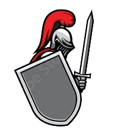

# Chivalry-Auth 

### This project utilizes Express and MongoDB for the server-side development.  On the client side, JavaScript, HTML, and SCSS are used.  The design is inspired by a medieval knights clan, contributing a creative and unique aspect to the project.

---

This project utilizes a database to store data and provides access to it through **REST APIs**.  The APIs are written in _NodeJS_ and _typescript_, using the _express_ framework with _typescript_.

The project incorporates the following APIs:

| User authentication
| ----------------------------------- |
| + Register |
| + Login |
| + Logout |

---

### **Running the project :**

**Requirements**

- _NodeJS_ version 16.4+
- _MongoDB service_ version 6.0.1+

**Command lines**

- `npm run start`  Build the _TS_ code and execute the compiled _JS_ project.
- `npm run dev`  Run _TS_ code with _nodemon_ for seamless development

- `cd-client`  Access the client directory to initiate client-side development.
  - `npm run sass-compile`  Compile all the _SCSS_ files to _CSS_ files.
  - `npm run sass-watch-folder` Automatically compiles SCSS files into CSS files whenever changes are detected.

---

### **A practical example that exemplifies how the project can be utilized**

---

### The technologies used in this project include:

- [x] _**Nodejs**_ : the project is _javascript_ based.
- [x] _**Express**_ : used for the server side routers, middlewares, controllers, and services.
- [x] _**Typescript**_ : the project has been implemented using _typescript_ interfaces.
- [x] _**jwt**_ : implementing authentication using JSON Web Tokens involves securely storing the token for the authenticated user.
- [x] _**MongoDB**_ : utilized with the _**mongoose**_ library for defining schemas and models, which are then utilized in the controllers and services.
- [x] _**Bcrypt**_ : user passwords are securely encrypted in accordance with best practices to ensure data security.

### Additional technologies used as development tools include:

- [x] _**ESLINT**_ : the project adheres to the _ESLint_ guidelines and follows the best practices recommended by _airbnb_.
- [x] _**nodemon**_ : watches for _typescript_ file changes and compiles them in real-time.

## Author

:octocat: **Afek Sakaju**

- LinkedIn: [@afeksa](https://www.linkedin.com/in/afeksa/)
- GitHub: [@afekTheMiniLearner](https://github.com/afekTheMiniLearner)
